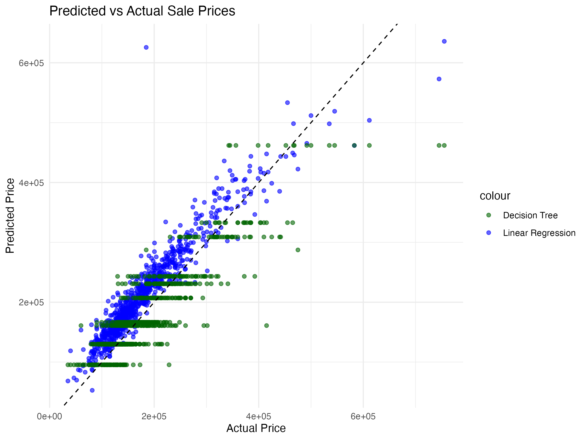

# 🏡 House Price Analysis

This project uses regression techniques to predict house prices based on various features from a structured dataset. It compares a Linear Regression model and a Decision Tree model, evaluating their performance on a hold-out test set.
using the Ames Housing dataset.

## Dataset

The dataset contains 2,930 observations and 82 variables, describing residential properties in Ames, Iowa. It includes features such as:

- Living area
- Year built
- Number of bathrooms and garage capacity
- Neighborhood
- Basement and first-floor area
- Fireplace count

**Source:** [Ames Housing Dataset on Kaggle](https://www.kaggle.com/datasets/prevek18/ames-housing-dataset?resource=download)

The file used in this project is `houses.csv`, which was downloaded from the link above.

## Objective
The goal is to build models that can accurately predict house sale prices (SalePrice) and evaluate their performance using appropriate regression metrics.

## Files
- `analysis.R`: R script with data cleaning, model training, and evaluation
- `houses.csv`: Housing dataset (if included)
- `.Rproj`: RStudio project file

## Technologies
- Language: R
- Libraries: caret, rpart, Metrics, rpart.plot, ffplot2, dplyr

## Project Structure
```
house-price-analysis/
│
├── analysis.R                # R script with full pipeline
├── house_price_analysis.Rmd  # Optional R Markdown notebook
├── houses.csv                # Dataset
├── README.md                 # Project documentation
├── images/                   # Exported graphs
│   └── price_comparison.png  # Saved ggplot image
```

## Workflow Overview
1. Data loading and cleaning

Removed irrelevant ID variables (Order, PID)

Checked for missing values

2. Data splitting

Stratified split into training (70%) and testing (30%) sets using caret::createDataPartition

3. Feature selection

Manually selected numeric predictors based on domain knowledge:

4. Model training

Linear Regression with lm()

Decision Tree Regression with rpart(method = "anova")

5. Evaluation

Performance measured with:

RMSE (Root Mean Squared Error)

R² (Coefficient of Determination)

## Model Comparison
Model	RMSE	R²
Linear Regression	38,334.59	0.8002
Decision Tree	(your value)	(your value)

The Linear Regression model slightly outperformed the Decision Tree in terms of both RMSE and R².

## Visualization
A regression tree was plotted using rpart.plot() for interpretability

Predicted vs. Actual values can be visualized with ggplot2

## 📷 Model Predictions Visualization



The scatter plot above compares the predicted house prices from both models against the actual sale prices. Each point represents a property in the test set:

- **Blue dots** correspond to predictions from the **Linear Regression model**
- **Green dots** correspond to predictions from the **Decision Tree model**
- The **black dashed line** represents perfect prediction (i.e., predicted = actual)

We observe that the linear regression predictions align more closely to the ideal line, indicating better accuracy overall. In contrast, the decision tree model shows more horizontal clustering, which is typical of trees that predict in discrete value steps. This visual reinforces the evaluation metrics: the linear regression model achieved lower RMSE and higher R² compared to the decision tree.


## Models
- Linear Regression
- Decision Tree

## Metrics
- Mean Squared Error (MSE)
- Visual comparison of predictions vs actual prices

## Skills Demonstrated
Data cleaning and preprocessing

Feature selection and engineering

Supervised learning: regression (linear and non-linear)

Model evaluation and comparison

Code documentation and reproducibility
